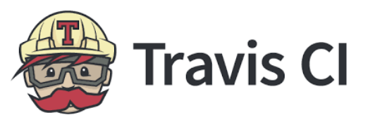

---
output:
  html_document:
    number_sections: false
    includes:
      in_header: itn_favicon.html
css: css/ITN_style.css
---

```{r, echo=FALSE, results='asis'}
ottrpal::borrow_chapter(
  doc_path = "chunks/create_itn_header.md",
  tag_replacement = list(
    "{TITLE}" = "CI/CD", 
    "{SUBTITLE}" =  "Tools and Tips",
    "{PATH_TO_PNG}" = "https://raw.githubusercontent.com/ottrproject/cheatsheets/refs/heads/main/pngs/cicd.png"
    ))
```

<hr>


<div class="row">
<div class="column">
# What is CI/CD?

CI/CD = Continuous Integration/Continuous Deployment

The idea is to **test your code as you develop it**.

In other words, if you make a change to your code, you can run your code to see if how it works with **different conditions and environments**.

This can simulate different software users   or data analysis contexts .


</div>

<div class="column">

# Benefits of CI/CD

- Catch software bugs earlier
- Catch data analysis code bugs too!
- Enhance public trust in your code/software
- Determine if your software updates will work for users on different machines
- Determine if your data analysis code still has the expected outcomes with different permutations

</div>

</div>

<hr>

<div class="row">
<div class="column">
```{r, fig.align='center', out.width="100%", echo = FALSE, fig.alt= "problems accumulate without CICD"}
ottrpal::include_slide("https://docs.google.com/presentation/d/1-85FZ5hpKKXdqq0bnWPNKO6Mkb9IzSr6N4Je9Y3S_6g/edit?slide=id.g35279513746_0_2350#slide=id.g35279513746_0_2350")
```
</div>
<div class="column">
```{r, fig.align='center', out.width="100%", echo = FALSE, fig.alt= "problems accumulate without CICD"}
ottrpal::include_slide("https://docs.google.com/presentation/d/1-85FZ5hpKKXdqq0bnWPNKO6Mkb9IzSr6N4Je9Y3S_6g/edit?slide=id.g35279513746_0_2381#slide=id.g35279513746_0_2381")
```

</div>

</div>

<hr>

# Implementing CI/CD

- CI/CD typically uses other infrastructure, such as version control and containers or virtual machines
  - Version control is the process of tracking changes over time
  - There are [several tools](https://icubetechnolabs.com/github-vs-gitlab-vs-bitbucket-which-version-control-system-is-right-for-you/) for version control ([GitHub](https://github.com/), [GitLab](https://about.gitlab.com/topics/version-control/), [Bitbucket](https://bitbucket.org/product/version-control-software)), but [GitHub](https://github.com/) is one of the most commonly used by researchers
  - Containers or virtual machines enable us to run code in different [computing environments](https://hutchdatascience.org/Containers_for_Scientists/02-why-containers.html) (which is the specific software for a given computer). 
  - Check out our [ITN course about containers](https://hutchdatascience.org/ITN_course_search/Containers_for_Scientists_coursePage.html)!
- Lab members need to know what working standards are required
  - Onboarding documents like these can help: 
    - [Fertig Lab](https://fertiglab.github.io/onboarding/)
    - [Collado-Torres Lab](https://lcolladotor.github.io/bioc_team_ds/onboarding.html)
- This [novel about CI/CD](https://itrevolution.com/product/the-phoenix-project/) called _The Phoenix Project_ might be helpful. Check out this [excerpt](https://itrevolution.com/wp-content/uploads/2022/06/TPP5_excerpt.pdf)!

<hr>
  
# CI/CD Tools

The following tools can be used for CI/CD.

<div class = myStyle>
|Tool|Price| Custimizability|Integration|Tutorials|
|----|-----|-----|----|----|
|<a href="https://www.travis-ci.com/">  </a> | Free for public repos| Low|GitHub, GitLab, Bitbucket| [Travis CI Guide](https://docs.travis-ci.com/user/for-beginners/)|
|<a href="https://circleci.com/"> </a>| Free for public repos | High|GitHub, GitLab, Bitbucket|[CircleCI Guide](https://circleci.com/docs/getting-started/) |
|<a href="https://docs.gitlab.com/ci//"> </a>| Free for public repos| High|Intended for GitLab, GitHub, Bitbucket|[GitLab CI Guide](https://docs.gitlab.com/ci/) |
|<a href="https://github.blog/enterprise-software/ci-cd/build-ci-cd-pipeline-github-actions-four-steps/"> </a>| Free for public repos| High|Intended for GitHub, GitLab with some effort|[ITN Course on GitHub Actions](https://hutchdatascience.org/ITN_course_search/GitHub_Automation_for_Scientists_coursePage.html) |
|<a href="https://www.jenkins.io/"> </a>|Free for public or private repos (other potential costs)| Very high|GitHub, GitLab, Bitbucket|[Jenkins Guide](https://www.jenkins.io/doc/pipeline/tour/getting-started/)
</div>
 
 


```{r, echo=FALSE, results='asis'}
ottrpal::borrow_chapter(
  doc_path = "chunks/create_itn_footer.md",
  tag_replacement = list(
    "{AUTHORS}" = "Content for this cheatsheet came from Candace Savonen and Carrie Wright. It was summarized and formatted by Carrie Wright. Icons from https://www.iconpacks.net. The cheatsheet was also inspired by a discussion that involved the ITCR OPEN community (https://www.itcrtraining.org/open)."))
```

