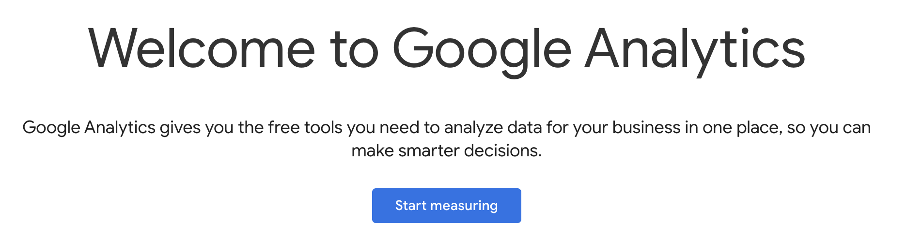
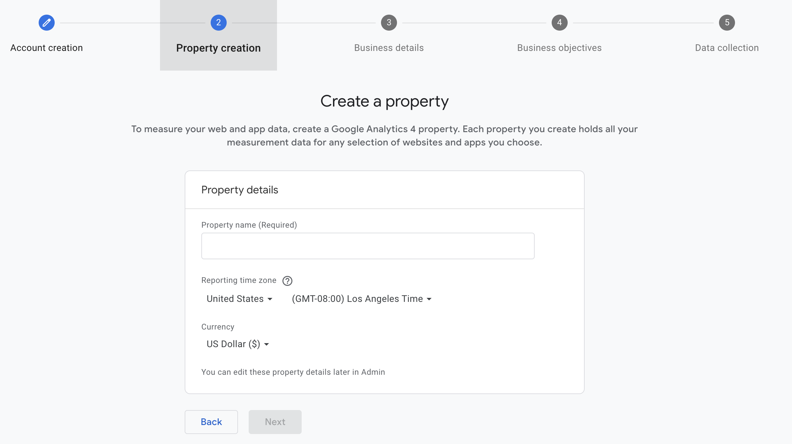
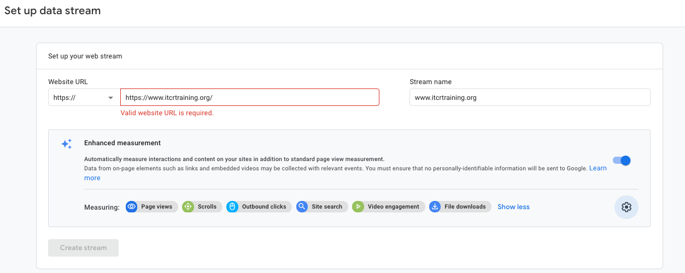
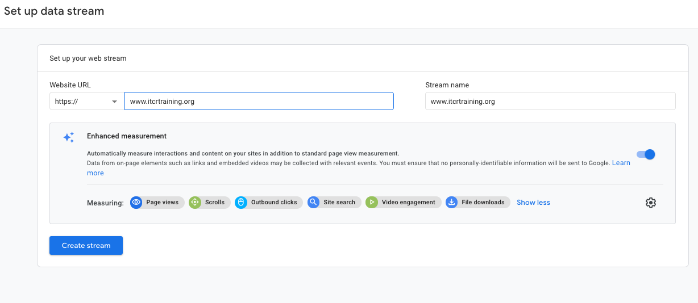
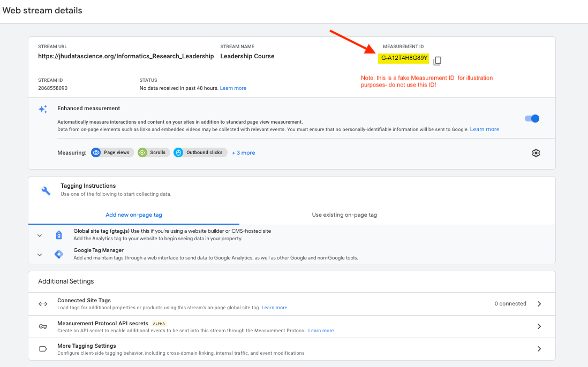
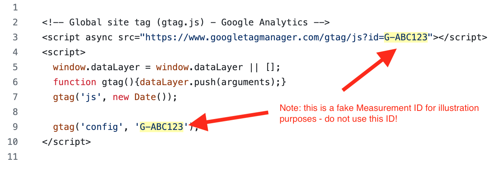
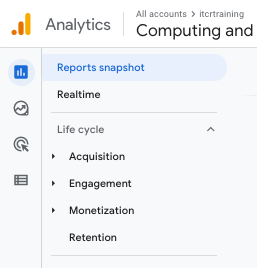
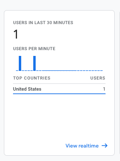

---
output:
  html_document:
    number_sections: false
    includes:
      in_header: itn_favicon.html
css: css/ITN_style.css
---

```{r, echo=FALSE, results='asis'}
ottrpal::borrow_chapter(
  doc_path = "chunks/create_itn_header.md",
  tag_replacement = list(
    "{TITLE}" = "Google Analytics",
    "{SUBTITLE}" = "Integration with OTTR",
    "{PATH_TO_PNG}" = "https://raw.githubusercontent.com/ottrproject/cheatsheets/refs/heads/main/pngs/google_analytics.png"
    ))
```

<hr>

# Set Up Google Analytics

Follow these steps to enable traffic tracking for your OTTR course or website.

**1. Create a Google Analytics account** (if you do not already have one): <a href="https://analytics.google.com/analytics" target="_blank">https://analytics.google.com/analytics</a> 

Click on **Start measuring**. 
 

You will need to agree to Google's terms during account creation. Tracking is currently free as long as your course does not exceed a very high user rate.

**2. Create a new Property** — fill in a name and details, and select the options that reflect how you intend to use Google Analytics.




**3. Accept Terms** 

To use Google Analytics you must first accept the terms of service agreement for your country / region.

**4. Add a Data Stream** to your property — choose the **Web** option.


**5. Enter the URL** for your course. Note: the `https://` portion is selected from a dropdown to the left of the URL field — do not include it in the text box.




**6. Copy your Measurement ID** from the resulting page. It will look like `G-XXXXXXXXXX`.



<hr>

# Configure Your OTTR Repo

::::: row

::: column

## For OTTR (Rmd-based) Courses

**Update `GA_Script.html`** — replace both instances of `{MeasurementID}` (including the curly brackets) with your Measurement ID:

```html
<!-- Global site tag (gtag.js) - Google Analytics -->
<script async src="https://www.googletagmanager.com/gtag/js?id=G-ABC123"></script>
<script>
  window.dataLayer = window.dataLayer || [];
  function gtag(){dataLayer.push(arguments);}
  gtag('js', new Date());
  gtag('config', 'G-ABC123');
</script>
```



**`_output.yml` is already configured** in the updated OTTR template — no manual changes needed. It should include:

```yaml
includes:
  in_header: GA_Script.html
  before body: ...
```


:::

::: column

## For OTTR Quarto Courses

**Update `_quarto.yml`** — add your Measurement ID under the `google-analytics` field:

```yaml
google-analytics:
  tracking-id: "G-XXXXXXXXXX"
```

The `GA_Script.html` file is also included via `include-in-header` in `_quarto.yml`:

```yaml
format:
  html:
    include-in-header: GA_Script.html
```

The updated template handles both of these — you only need to paste in your Measurement ID.

:::

:::::

<hr>

# Trigger a Re-render

After updating `GA_Script.html`, the GitHub Action will automatically re-render your course because the updated OTTR template watches for changes to `GA_Script.html`:

```yaml
# In .github/workflows/render-all.yml
on:
  push:
    paths:
      - '*.Rmd'
      - 'assets/*'
      - '*.yml'
      - 'GA_Script.html'   # <-- triggers render on GA changes
```

You can verify the Google Analytics code was included by opening any rendered HTML file in `docs/` and searching for `Google Analytics`.

> **Note:** If you are working with an older template, you may need to manually trigger the `render_all` workflow. Make sure both `_output.yml` and `GA_Script.html` are updated with matching file names and the correct Measurement ID. Occasionally this also requires setting up a `GH_PAT` for the repo (with `actions` and `repo` permissions) — not just the organization.

<hr>

# Verify Traffic Is Being Tracked

1. Log in to <a href="https://analytics.google.com/analytics" target="_blank">Google Analytics</a>.

1. Click the **gear icon** (lower left) → **Data Collection and Modification** → **Data Streams**.

1. Click on your stream — it will indicate whether traffic has been received.

1. To test, click **Test** on the stream page. Even if the test passes, **also open your live course URL** and check Google Analytics to confirm you appear as a visitor.

1. Click the **Home button** in Google Analytics — it should say **"Data collection is active"**.

1. Check the **Reports** tab (bar chart icon, upper left). If you open your course in a browser, you should see yourself counted as 1 user in the last 30 minutes.




<hr>

# Troubleshooting

| Issue | What to Check |
|------------------------------------|----------------------------------------------------|
| No data showing in GA | Make sure the **Measurement ID** in `GA_Script.html` matches the property in Google Analytics |
| Data stream shows no traffic | Check that the **URL** in the stream matches your course URL — watch for `https` vs `http` |
| Old template not rendering GA | Manually run the `render_all` workflow; confirm both `_output.yml` and `GA_Script.html` are updated, and that the `GA_Script.html` filename is consistent in both files |
| Render not triggering | Ensure `GH_PAT` is set up for the repo (with `actions` and `repo` permissions), not just the organization |

```{r, echo=FALSE, results='asis'}
ottrpal::borrow_chapter(
  doc_path = "chunks/create_itn_footer.md",
  tag_replacement = list(
    "{AUTHORS}" = "Content for this cheatsheet was written by Carrie Wright. It was formatted by Padmashri Saravanan."))
```
