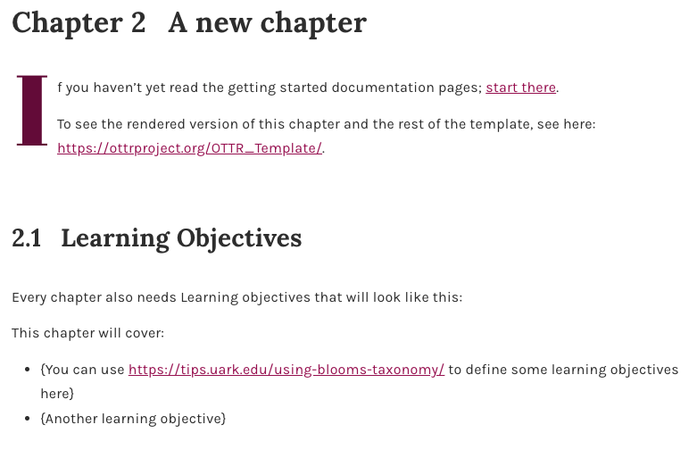

---
output:
  html_document:
    includes:
      in_header: ottr_favicon.html
css: css/OTTR_style.css
---

```{r, echo=FALSE, results='asis'}
ottrpal::borrow_chapter(
  doc_path = "chunks/create_ottr_header.md",
  tag_replacement = list(
    "{TITLE}" = "OTTR CSS",
    "{SUBTITLE}" = "Customizing Colors & Style",
    "{PATH_TO_PNG}" = "https://github.com/ottrproject/cheatsheets/blob/main/pngs/ottr_style.png?raw=true"
  ))
```

## How Colors Are Controlled

Two CSS files work together to separate OTTR defaults from your customizations:

<div style="display: grid; grid-template-columns: 1fr 1fr; gap: 2em;">

<div>
### `style_config_default.css`
**Gets synced** from OTTR

- Defines all default CSS variables
- Ensures new variables exist before `style.css` references them
- Do not edit, changes will be overwritten on sync
</div>

<div>
### `style_config_custom.css`
**Not synced** 

- Overrides defaults
- Set your custom colors here
- Changes are safe from future syncs
</div>

</div>

## Customizing Your Colors

Edit `style_config_custom.css` to override any default variable:

```css
:root {
  --link-color: #your-color-here;
  --heading-color: #your-color-here;
}
```

- [ ] Open `style_config_custom.css` in your repository
- [ ] Override only the variables you want to change
- [ ] Commit changes to a new branch and open a pull request

<p class="comment">
_You only need to set the variables you want to change. Anything not set in `style_config_custom.css` will fall back to the defaults in `style_config_default.css`._
</p>

For example, within your `assets/style_config_custom.css` file, you would add: 

```
:root {
    --link-color: #a1005a;              /* deep magenta for links */
    --accent-color: #6e0040;            /* dark rose (headings, emphasis) */
    --highlight-color: #e754a6;         /* vibrant pink for UI highlights */
    --caption-color: #4a4a4a;           /* neutral dark gray */
    --background-color: #ffffff;
    --callout-background-color: #f6e9f1; /* soft pink-tinted gray */
  }
```

<div style="display: grid; grid-template-columns: 1fr 1fr; gap: 2em;">

<div>
```{r, echo=FALSE, fig.cap="Default colors", fig.align='center'}
knitr::include_graphics("resources/images/style_default.png") 
```


</div>


<div>
```{r, echo=FALSE, fig.cap="Changed colors", fig.align='center'}

```
</div>

</div>

#### Recommended Resources

**1. Venngage Color Accessibility Tool**: <https://venngage.com/tools/accessible-color-palette-generator>

**2. ColorBuddy**: <https://color-buddy.netlify.app/>


## Receiving CSS Updates via Sync

If your repo is enrolled in OTTR sync, future CSS improvements will be updated automatically via your pull request.

- [ ] Confirm you have enrolled for [sync updates](ottr_sync.html)
- `style_config_default.css` will update on sync. **Do not customize this file**.
- Your customisations in `style_config_custom.css` will not be touched

```{r, echo=FALSE, results='asis'}
ottrpal::borrow_chapter(
  doc_path = "chunks/create_ottr_footer.md",
  tag_replacement = list(
    "{AUTHORS}" = "Padmashri Saravanan from [BioData Sage](https://www.biodatasage.com/) created the cheatsheet content. Katherine Cox structured OTTR's color customizations. Carrie Wright reviewed the material. Kate Isaac created the original styling, Carrie Wright did the css styling and Carrie Wright and Candace Savonen did the publishing engineering for the cheatsheet."
  ))
```