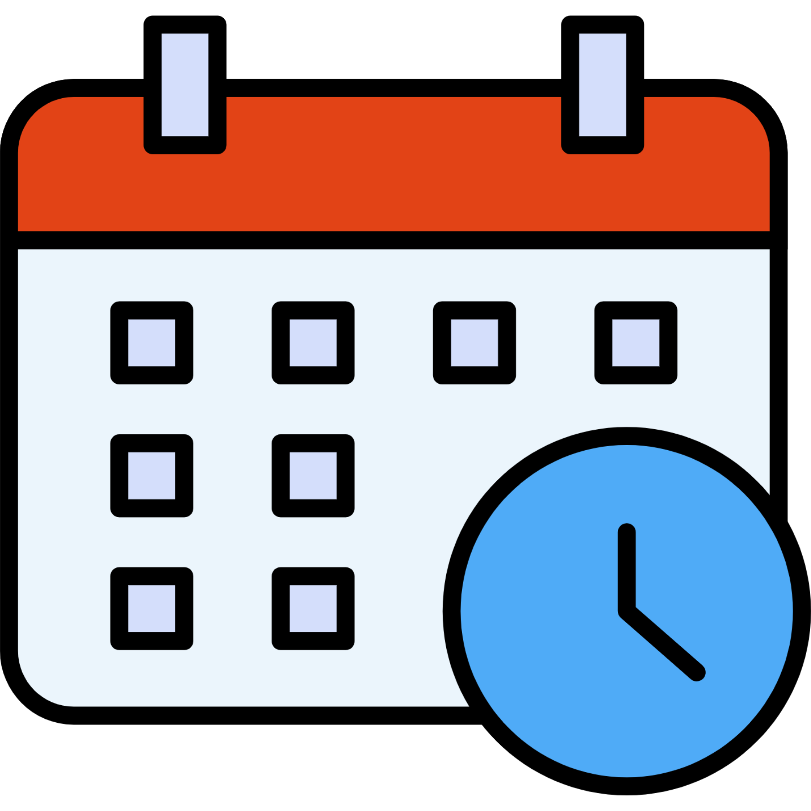

---
output:
  html_document:
    number_sections: false
    includes:
      in_header: itn_favicon.html
css: css/ITN_style.css
---


```{r, echo=FALSE, results='asis'}
ottrpal::borrow_chapter(
  doc_path = "chunks/create_itn_header.md",
  tag_replacement = list(
    "{TITLE}" = "Presenting Talks", 
    "{SUBTITLE}" =  "Best Practices",
    "{PATH_TO_PNG}" = "https://raw.githubusercontent.com/ottrproject/cheatsheets/refs/heads/main/pngs/talks.png"
    ))
```

<hr>

## Basics {-}

<div class="row">
<div class="column">

Research Talks at conferences will often have this structure:

- Background 
  - This should cover the context of the field and any information needed for people to understand your research.
- Significance
  - This section should describe why your work is important, why it is needed, and how it adds to the field.
  
- Methods
  - In this section, researchers describe in brief the basics about what general methods you used. 
  - Specific details should be covered if they are necessary in describing your work.
  - If you are using an unusal or new method that you developed, more detail should be described.
  
- Results
  - This is where you show figures and statistics of your results
  - It is also critical to explain your interpretation of your results, in other words, what might they mean, and what are possible limitations. 

- Impact and Future Directions
  - In this section, researchers describe what they plan to do next and the improtance of their results

</div>


<div class="column">
<center>
:::warning

If you don't know the answer to a question, tell the person asking that you don't know, but you cam share what you might speculate, just be clear that you are speculating. 

:::
</center>
</div>

</div>


<hr>

## Preparation {-}
<div class="row">
<div class="column">

<input type="checkbox">  Draft the slides

1. <input type="checkbox"> Determine the time limit required 

1. <input type="checkbox">  Draft slides according to the depth possible in the time limit. Focus on Visuals with less text.

1. <input type="checkbox">  Check your own slides for clarity of language

1. <input type="checkbox">  Check that fonts and figures are large enough

1. <input type="checkbox">  Check that figures aren't blury - you might need to use a higher quality or larger image

1. <input type="checkbox"> Practice giving your talk and adjust to fit the time limit (even if just to yourself!)

1. <input type="checkbox">  Fet feedback from others (including your PI and lab mates)


</div>

<div class="column">

<input type="checkbox">  Check that all jargon is explained

<input type="checkbox">  Check that all acronyms are spelled out the first time

1. <input type="checkbox"> Check that images cite sources if not original

1. <input type="checkbox">  Include a thank you slide, with grant numbers that funded the work

1. <input type="checkbox">  Optional: Include a link or QR code so others can find your talk easily!

1. <input type="checkbox">  Include your contact information, so others can reach out

1. <input type="checkbox">  Include your contact information, so others can reach out

<br>
<br>
<center>

</center>
</div>
</div>


<hr>

## Tasks Day of Event {-}

<div class="row">
<div class="column">

<input type="checkbox">  Show up early to check systems

<input type="checkbox">  Optionally have a back

- (e.g., "This session is about Topic X and will have Y speakers")

<input type="checkbox"> Provide housekeeping announcements

- (e.g., break time, voting, etc.)

<input type="checkbox">  Introduce speakers

- (name, role, institution, talk title)

<input type="checkbox">  Watch the time to ensure schedule is maintained

<input type="checkbox">  Ask the audience for questions

</div>

<div class="row">
<br>
<br>
<center>

</center>
</div>
<hr>

## Possible Challenges {-}

<div class="row">
<div class="column">
<br>
<br>
<br>
<br>
<br>
<center>

</center>
<br>
<br>
</div>
<div class="column">

1) **Technical Difficulties** 

`r config::get("arrow")` <input type="checkbox"> Have backup plans and do checks!

2) **Speakers may speak too long**

`r config::get("arrow")` <input type="checkbox"> Notify speakers of time limits (5 min left, 1 min left) 

`r config::get("arrow")` <input type="checkbox"> Interrupt the speaker if needed

<div class="comment">"Thank you for your talk. To stay on schedule, we'll need to transition."</div>

`r config::get("arrow")` <input type="checkbox"> Shorten question sessions as needed 

`r config::get("arrow")` <input type="checkbox">   Adjust subsequent speaker times if needed 

3) **People may ask too many questions**

`r config::get("arrow")`  <input type="checkbox"> Interrupt and ask for the discussion to happen later

<div class="comment">_"For sake of time, perhaps this can be discussed later."_</div>

4) **People may not have questions**

`r config::get("arrow")`  <input type="checkbox">  Ask your own question(s)

</div>
</div>


```{r, echo=FALSE, results='asis'}
ottrpal::borrow_chapter(
  doc_path = "chunks/create_itn_footer.md",
  tag_replacement = list(
    "{AUTHORS}" = "Content for this cheatsheet came from Kate Isaac, Carrie Wright, and Sean Davis.It was summarized and formatted by Carrie Wright. Icons from https://www.iconpacks.net. The cheatsheet was also inspired by this article: https://pmc.ncbi.nlm.nih.gov/articles/PMC2738972/ and ideas from AI: https://www.perplexity.ai/search/i-m-organizing-a-scientific-me-b5m7ym8jTBOl2MjdMhLlRw"
    ))
```
